# 🌱 RareFriends Valley

*Your Rare Friend inherits a little farm in a greyscale valley. Plant through four seasons, befriend a town where everyone is a Rare Friend, and film cute clips of it all.*

**▶ Play: https://m4s4t0-v01d.github.io/rarefriends-valley/** · **Preview page: https://m4s4t0-v01d.github.io/rarefriends-valley/preview/**
*(You need a browser wallet on Robinhood mainnet holding a hardwired Rare Friends Generations NFT.)*

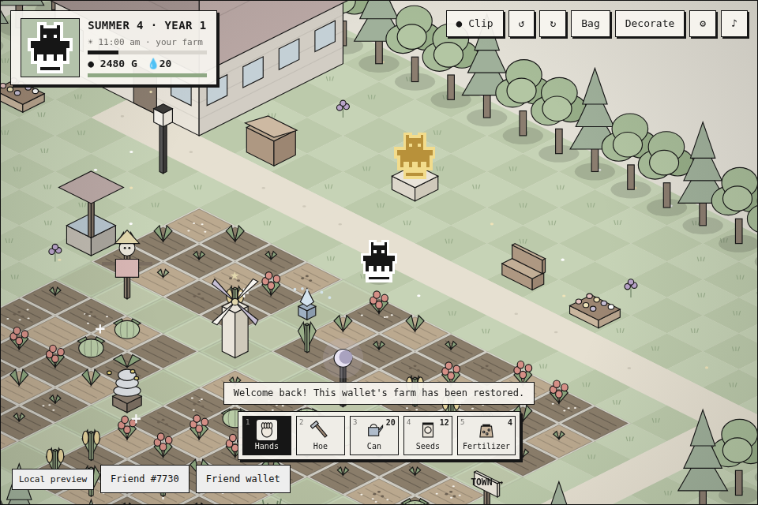

- **Your Friend is the farmer.** The Friend you select farms with its canonical on-chain sprite, and its Generations family gives a farming perk.
- **A full farming loop.** Clear weeds, rocks and stumps; till, plant and water. Crops grow overnight only if watered. Harvest, ship in the bin (paid each morning), and reinvest in seeds and tools.
- **Seasons, days and weather.** Ten crops across spring, summer, autumn and winter (7 days each). A 6 am–2 am clock with dusk and glowing nights; rain and snow water your crops.
- **Energy (fatigue).** Every tool costs energy. Tired Friends slow down; past 2 am you pass out. Eat crops or café food, or sleep.
- **A town where every NPC is a Rare Friend.** Eight villagers with schedules, favourite gifts and hearts. Your *other owned Friends* move in too, with their canonical art, and water your crops once they like you.
- **A rotating 2.5D camera.** Spin the valley in quarter turns.
- **Friend Films.** Record a clip: you get a looping GIF from the game's own encoder, plus a video *with the music* where the browser supports it. Post it to X. Every night also draws a diary card.
- **$RAREFRIENDS blessings.** Moonlight Blessings cost (simulated) RF. Keep them for daily fertilizer, morning dew, better prices or golden crops, or redeem them for RF. Each also grants RF décor that boosts nearby crops.
- **Progress saves per wallet.** Posts are tagged *@RareFriendsNFT #RareFriends #RareFriendsValley*.

| | |
| --- | --- |
| **Builder** | M4S4T0 · [@M4S4T0-V01D](https://github.com/M4S4T0-V01D) |
| **Category** | Character Spotlight (primary) · Economy Potential · Token Activity |
| **Stack** | [FriendSDK v0.1.2](https://github.com/spokesz/friendsdk/tree/v0.1.2) · React 19 · Canvas 2D · WebAudio · MediaRecorder · TypeScript |
| **Economy** | Simulated. Blessings use the SDK's preview RF ledger; no contracts or transactions. |
| **Wallet / network** | Browser wallet on **Robinhood mainnet (chain 4663)** holding a hardwired Generations NFT (generation ≥ 1) |

## Screenshots

| Spring (camera rotated) | Autumn | Winter |
| --- | --- | --- |
| 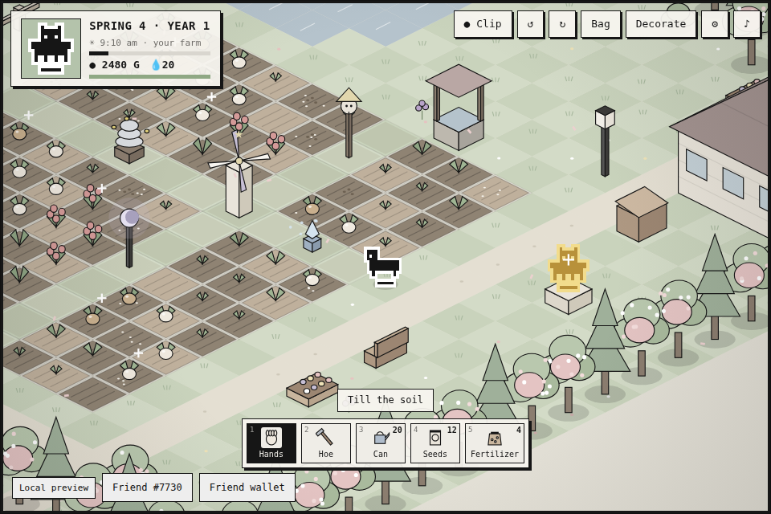 | 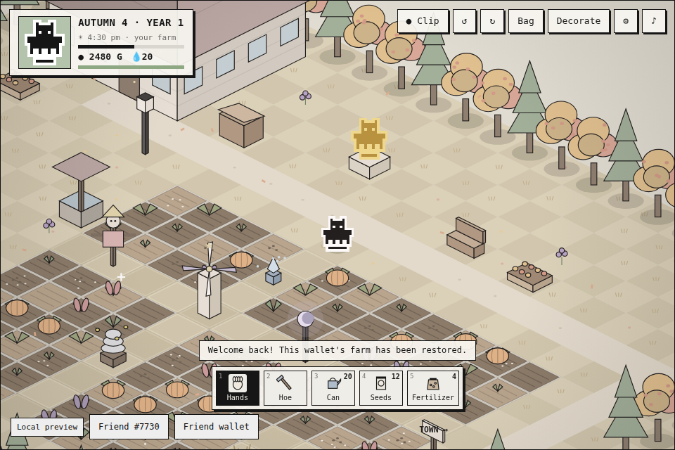 | 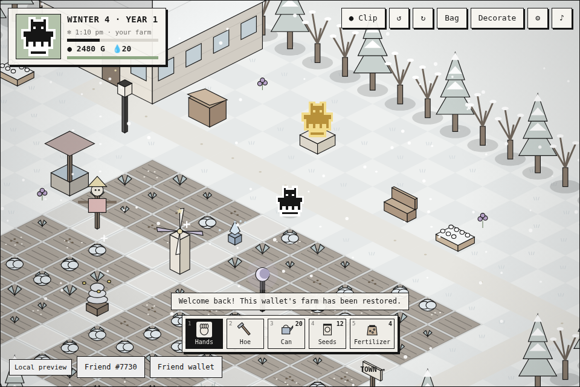 |
| **Night on the farm** | **Town of Rare Friends** | **General Store** |
| 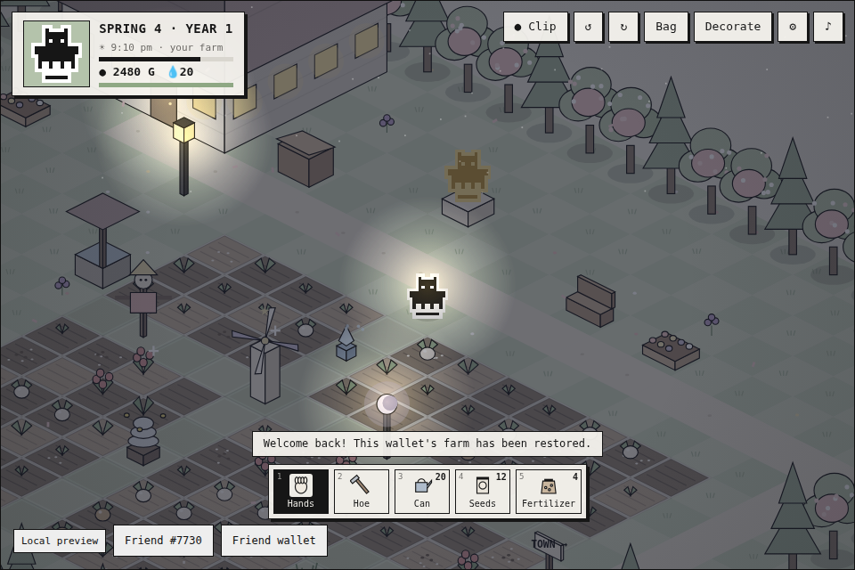 | 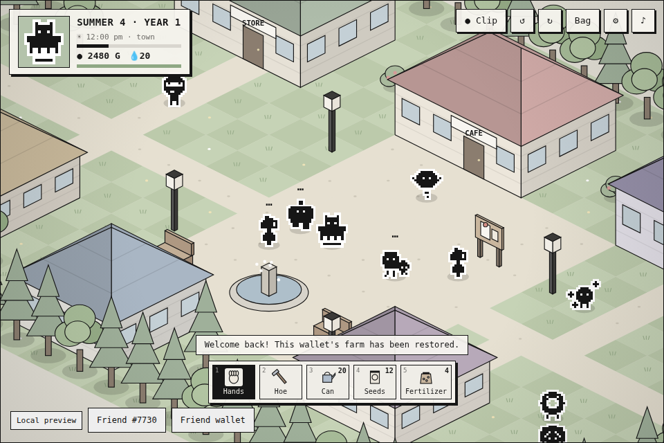 | 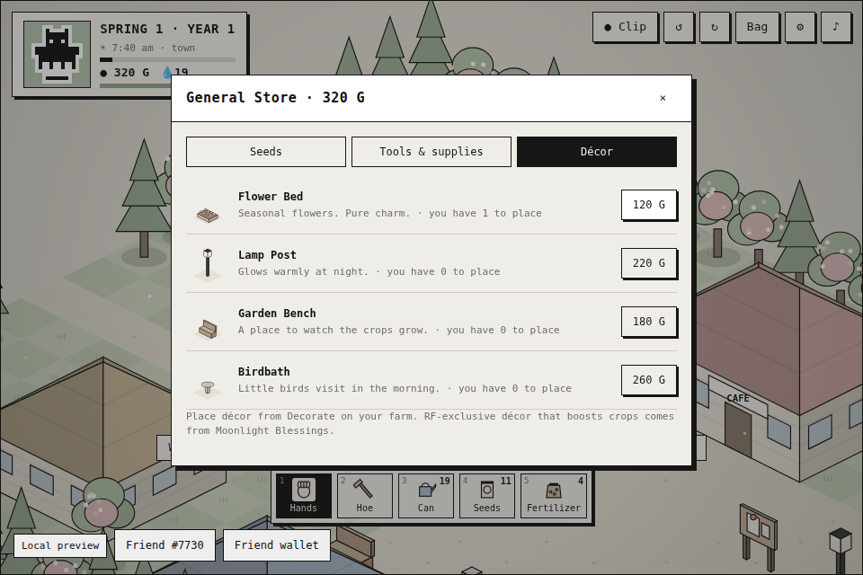 |
| **Moonlight Blessing** | **RF décor collection** | **Clip ready to post** |
| 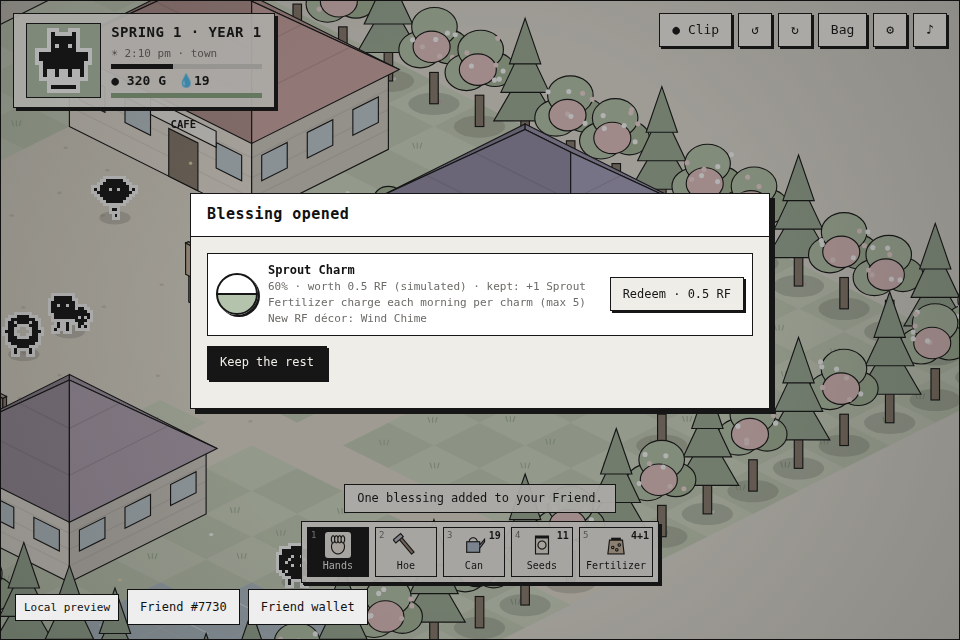 | 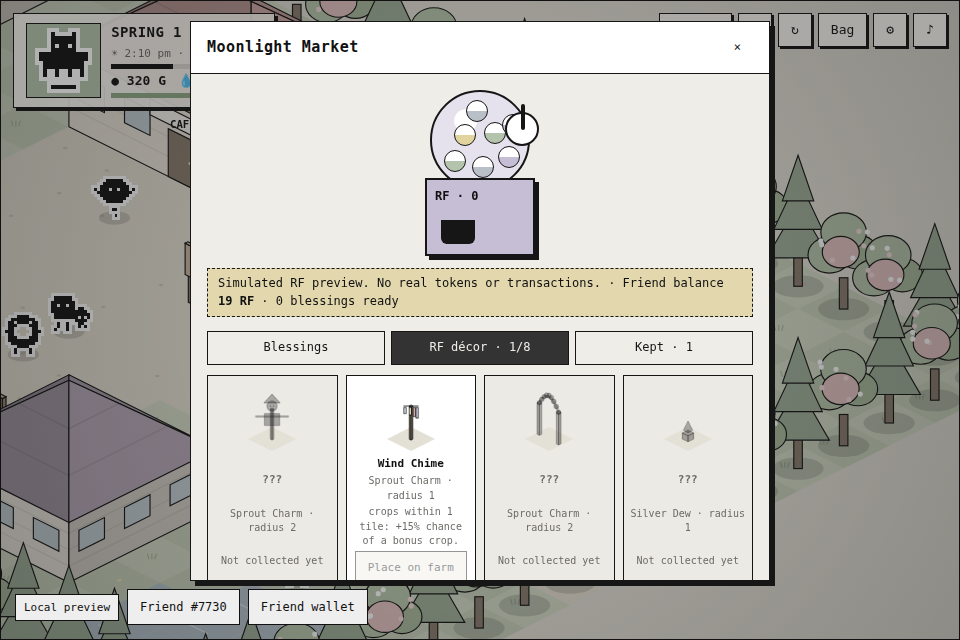 | 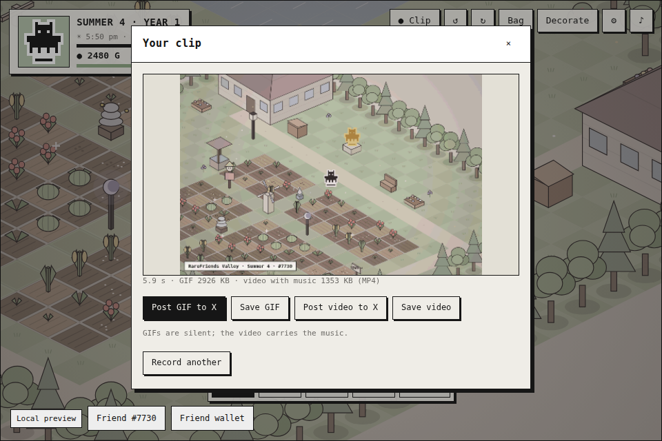 |

**A clip recorded in-game (GIF, slow camera orbit):**

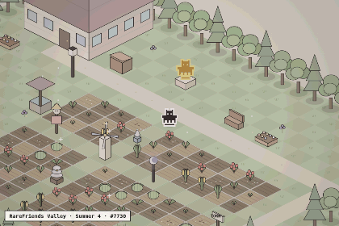

**The nightly diary card, ready to post on X:**

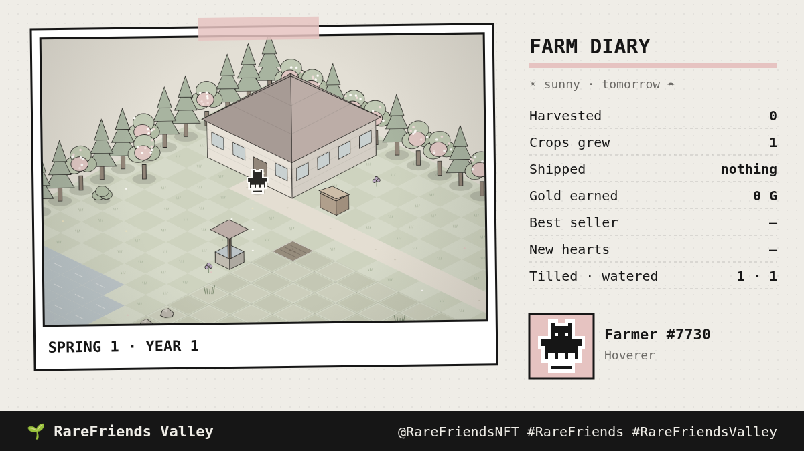

## How it plays

1. **Farm.** Tap a field tile with **Hands** and your Friend does what it needs: clear, till, plant, water or harvest. Or pick the Hoe, Can, Seeds or Fertilizer. Refill the can at the well or pond.
2. **Water daily.** Crops grow one day per night when watered. Fertilizer and RF décor add bonus growth; some crops regrow.
3. **Ship and shop.** Put crops in the bin by your house (paid in the morning). Walk the road east to **town** for seeds, tool upgrades, décor, café food and the **Moonlight Market**.
4. **Make friends.** Talk to villagers daily and give gifts they love. The notice board posts a request every morning.
5. **Rest.** Watch your energy, and go to bed before 2 am. The diary sums up the day and draws a card to post.
6. **Film it.** Press **● Clip** (or C), then post the GIF or video to X.

Full rules, numbers and controls: [games/rarefriends-valley/README.md](games/rarefriends-valley/README.md).

## How it uses Rare Friends and $RAREFRIENDS

**Character Spotlight.** The verified Generations NFT is the farmer, drawn from its **canonical on-chain sprite** in
the world, the HUD, the diary card and a **Golden Friend Statue**. Its **family sets a perk** (Hoverers walk faster,
Colossi have more energy, Hollows carry more water, and so on). Every NPC is a Rare Friend: the SDK's canonical sample
Friends plus procedural villagers in the same one-bit style. **Every other Friend in your wallet moves into town** with
its canonical art; befriend it and it waters your crops each morning.

**Token Activity / Economy Potential.** Every RF action goes through the SDK's reviewed chance-game client. It is
**simulated and clearly labelled**:

- **RF sink:** a Moonlight Blessing costs 1 RF and returns 0.88 RF in expected value. 12% of each purchase stays with the game as prize stake. Buying ×5 is supported.
- **Keep or redeem:** each blessing keeps a fixed RF value with no expiry, but only works on your farm while you keep it. This fits the SDK's backing model: each blessing reserves 5 RF.
  - Sprout Charm: daily Sprout Fertilizer charges.
  - Silver Dew: morning dew waters crops.
  - Moon Bloom: +10% sell price.
  - Golden Harvest: golden crops at ×3.
- **RF décor that boosts crops:** every blessing also grants one of 8 RF-exclusive pieces (scarecrow, sprinkler, beehive, Moon Lantern, Star Windmill, Golden Friend Statue…). Each boosts growth, watering, yield or golden chance in a radius. They carry no RF value, so they need no prize reserve; duplicates turn into Gold.
- **Two currencies:** Gold is earn-only, so the game is fully playable without spending. RF gives access to boosts and exclusive décor. It's a boost, not a paywall.
- **Holding more Friends pays off in game:** owned Friends become helpers who water your crops.

**Future integrations** (not in the SDK v0.1.2 API):

| Idea | Needs |
| --- | --- |
| Cloud saves across devices | A save/persistence API (today: per-device local storage) |
| RF-priced seed packs and seasonal cosmetics, part burned | An upgrade/cosmetic purchase action with RF burn |
| Live blessings with Dice RNG | The existing live chance-game contract flow, after Rare Friends review |
| Visiting another holder's farm, trading crops for RF | Cross-player actions/transfers |
| Clips minted or tipped in RF | Media or tipping APIs |

## Run it

Needs **Node.js 22+**, npm and Git. On Windows, use WSL2 Ubuntu, as the FriendSDK README describes.

```sh
git clone https://github.com/M4S4T0-V01D/rarefriends-valley.git
cd rarefriends-valley
npm ci
npm run dev            # http://localhost:4173   ·   npm run dev:lan to play from a phone on the same Wi-Fi
npm run build          # static site → games/rarefriends-valley/.friendsdk/
npm run build:preview  # the /preview/ page (with its record-player music) → .friendsdk/preview/
```

On a phone, open the Pages link in a wallet app's in-app browser (for example MetaMask Mobile). Landscape gives the
biggest view. FriendSDK is vendored as `vendor/rarefriends-friendsdk-0.1.2.tgz`, packed from the official `v0.1.2` tag
(see [NOTICE.md](NOTICE.md)). `.github/workflows/pages.yml` runs every check below and deploys to GitHub Pages on
each push to `main`. `node scripts/capture-docs.mjs` regenerates the screenshots and showcase clip from crafted saves.

## Checks

```sh
npm run typecheck      # tsc strict (game + host + preview)
npm test               # 25 unit tests: both maps and routing, the rotating camera, farming loop, regrowth and
                       # withering, weather, energy and passing out, shipping and prices, shops and upgrades,
                       # RF décor boosts, blessings, villagers' schedules, gifts and hearts, owned-Friend helpers,
                       # requests, taps and travel, saves, roster parsing, economy table, GIF/LZW round-trips
npm run check          # friendsdk check
npm run test:browser   # SDK mock-wallet browser runs:
                       #  • 960 px: a full day (walk, till, plant, water, hoe, rotate, bag, record a clip → GIF,
                       #    travel to town, buy seeds and décor, open a blessing, place décor, sleep → diary → day 2, music)
                       #  • 390 px touch: tap to walk, rotate, tools, hotbar fits
                       #  • custom host: two-Friend wallet → #3412 moves in, clip GIF posted/saved through the host,
                       #    video saved, diary card copied + X post, save and reload → "Welcome back"
                       #  • preview page: the record player plays audibly on click and tap, and stops
```

The mock wallet exists only in tests. `dev` and public builds always use the real ownership gate.

## How the host extends the SDK

The runtime page is the SDK's own **`GameHost`**: wallet connection, owned-Friend picker, fresh
`readGenerationEligibility` check, simulated ledger, confirmations and the `allow-scripts` sandbox.
`host/runtime.tsx` adds three things the SDK doesn't supply:

1. **Owned-Friend roster.** A read-only watcher (`eth_accounts` only) runs the SDK's account-filtered `readOwnedFriends`, so your other Friends can move into town. It never scans the collection.
2. **Per-wallet saves** in the trusted page's `localStorage` (the sandbox has no storage), keyed by wallet address.
3. **Sharing pictures, GIFs and videos.** On your click, the page uses the share sheet (phones), or saves the file and opens a prefilled X post (desktop), or copies the diary picture. Nothing posts without you pressing Post.

The game receives the roster and save only over `postMessage` from its parent window. It uses them only if the
roster contains the Friend the runtime just verified. There are no signatures, transactions or extra wallet prompts.
Under the plain SDK CLI (`npx friendsdk dev` / `test`), the game runs without these extras.

## Known issues and limitations

- Saves live in this browser on this device, keyed by wallet address. They are client-side, so a determined player could edit their own Gold.
- Blessing RF balances and kept blessings live in the SDK's session ledger and reset on reload. RF décor is saved.
- Video recording depends on the browser: Chrome and Safari record MP4 (which X accepts), and Firefox records WebM (save it, or post the GIF). GIFs are silent.
- Villagers are procedural art in the Rare Friends style, except the SDK's canonical sample Friends and your own. The roster needs the RPC to return the wallet's transfer history.
- Audio starts on your first tap. On iPhones before iOS 17, silent mode may keep it quiet.
- Wallet support is the SDK's (injected / EIP-6963; no WalletConnect).
- The browser tests use the SDK's mocked wallet. A real-wallet playtest on Robinhood mainnet is still needed; the build environment can't reach mainnet.

## Credits

Built for the Rare Friends Vibeathon by **M4S4T0** ([@M4S4T0-V01D](https://github.com/M4S4T0-V01D)) with an AI coding agent.
FriendSDK, the Rare Friends artwork and the SDK sound kit are by Rare Friends; see [NOTICE.md](NOTICE.md). Scenery, crops,
décor, icons, villager Friends, the GIF encoder and all music and sound effects are original code.
Gameplay inspired by farming life sims such as *Harvest Moon*. No assets from them are used.
Also by M4S4T0: [RareFriends Cafe](https://m4s4t0-v01d.github.io/rarefriends-cafe/preview/).
